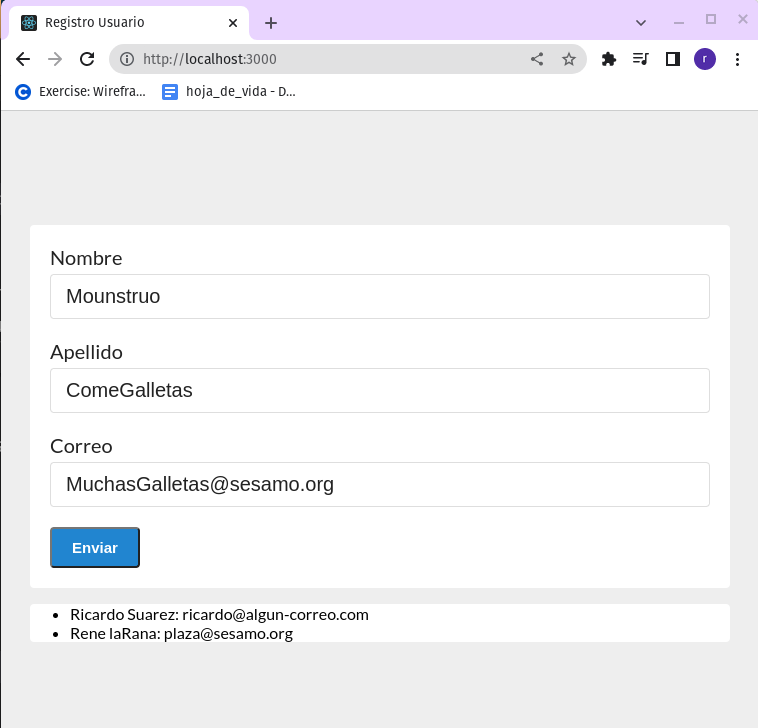

# Ejercicio 1 de Formularios y hooks

Este ejercicio hace parte del curso de react "React - Guía definitiva: hooks router redux next +Proyectos"

El resultado de la App es una forma que se ve asi:

